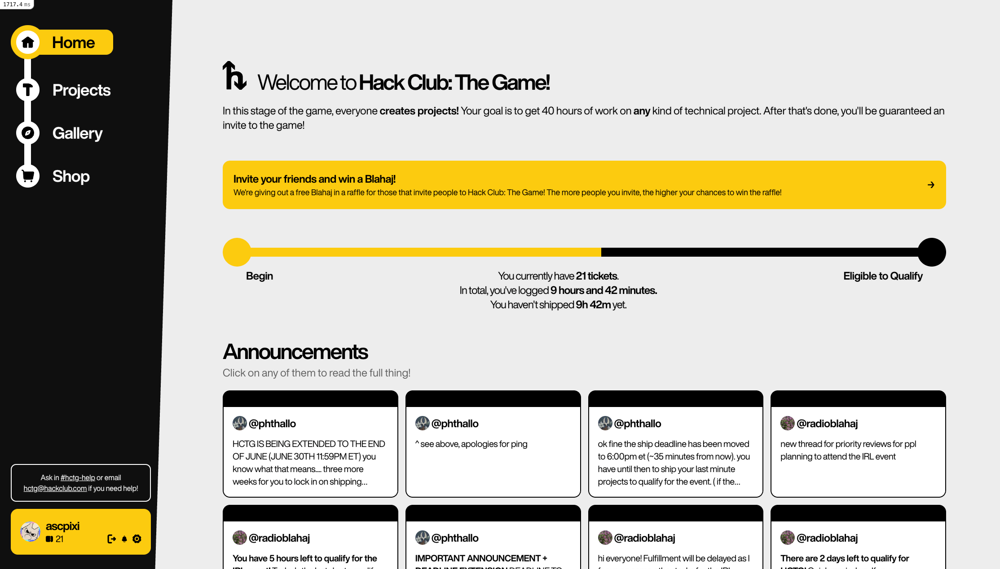

# Hack Club: The Game (YSWS)
This is the Rails app behind [Hack Club: The Game](https://game.hackclub.com) - the YSWS (You Ship, We Ship) platform for HC:TG. For the mobile website used at our flagship in-person event, check out [`hackclub/theplatform`](https://github.com/hackclub/theplatform)!

<p align="center">
  
</p>

## Getting Started

Setting up the platform is roughly the same as setting up any other Rails app.

> [!NOTE]
> On Windows, we recommend using a [GitHub Codespace](https://codespaces.new) or WSL2.

### Prerequisites

- **Ruby 3.4.7**: we recommend [rbenv](https://github.com/rbenv/rbenv) or [mise](https://mise.jdx.dev/)
- **Node.js 22+**: install via [nvm](https://github.com/nvm-sh/nvm), [fnm](https://github.com/Schniz/fnm), or [mise](https://mise.jdx.dev/)
- **PostgreSQL 16**: easiest via [Docker](https://www.docker.com/)

Redis is **not required** for local development, but strongly recommended for production.

### 1. Clone and configure

```bash
git clone https://github.com/hackclub/the-game.git
cd the-game
cp .env.example .env
```

Fill in `.env` with your credentials. At minimum, you'll need:

| Variable | Where to get it |
|---|---|
| `DATABASE_URL` | Pre-filled if you use the Docker command below |
| `SECRET_KEY_BASE` | Run `bin/rails secret` |
| `ACCOUNT_CLIENT_ID` / `SECRET` | Create an app on [auth.hackclub.com](https://auth.hackclub.com) |
| `HACKATIME_CLIENT_ID` / `SECRET` | Create an app on [hackatime.hackclub.com](https://hackatime.hackclub.com) |
| `ACTIVE_RECORD_ENCRYPTION_*` | Run `bin/rails db:encryption:init` |

Most other variables are optional for local development.

### 2. Start PostgreSQL

Run Postgres in a Docker container — this matches the default `DATABASE_URL` in `.env.example`:

```bash
docker run -d \
  --name game-postgres \
  -e POSTGRES_USER=postgres \
  -e POSTGRES_PASSWORD=password \
  -p 5432:5432 \
  postgres:16
```

If you already have Postgres running locally, just update `DATABASE_URL` in your `.env` accordingly.

### 3. Install dependencies and set up the database

Rails gives us a convenient command to install all dependencies and set up everything we need!

```bash
bin/setup
```

### 4. Start the dev server

```bash
bin/dev
```

Visit **http://localhost:3000** once both Vite and Rails are running.

